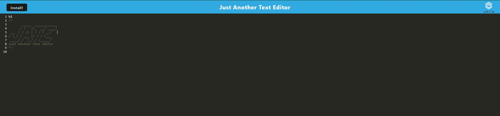

# PWA-text-editor

  ## Badges

  

  ## Table of Contents

  * [License](#license)
  * [Description](#description)
  * [Installation](#installation)
  * [Usage](#usage)
  * [Credits](#credits)
  * [Tests](#tests)
  * [Questions?](#questions)

  ## License

  This project was made using the MIT license.
  [License Link](https://opensource.org/licenses/MIT)

  ## Description

  This text editor is designed to be a PWA, providing an enhanced user experience with features like offline access, responsive design, and fast loading times.

  ## Installation

  First, clone my repository. Then, install the dependencies using npm i. Run the application, using npm start. Open your browser and navigate to http://localhost:3000 to access the PWA text editor.

  ## Usage

  Once in the local host, or in heroku link, install the text editor application. From there, you can type edit, and format the text.

  ## Credits

  ## Tests

  N/A

  ## Questions?
  ### Reach Me Here: 

  [Bcolo24](https://github.com/Bcolo24)